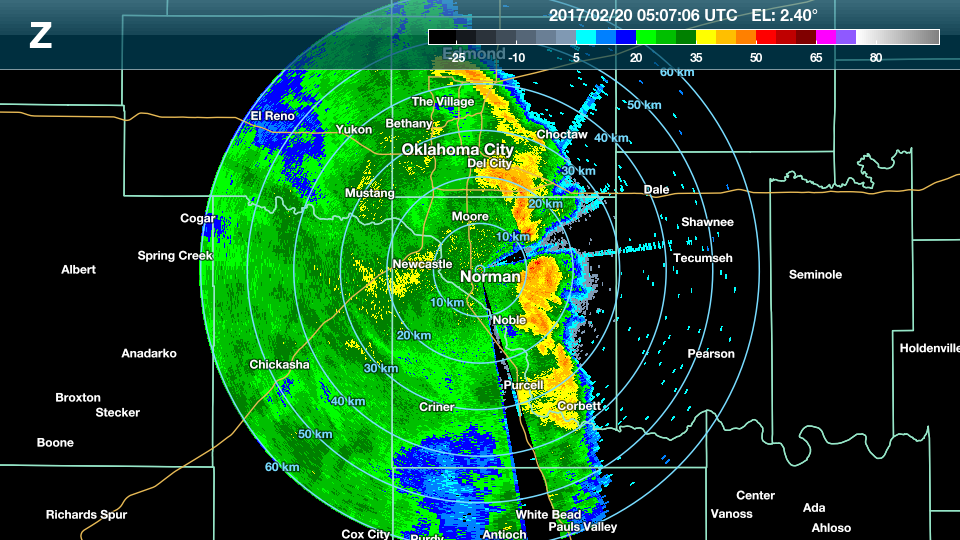

# ARRC Mobile Radar Datasets

This repository contains the data description and a few examples of reading the data into a Python and MATLAB space.

## Data Format

Data are stored in a self-describubg Network Common Data Form [NetCDF].

# Chart

A collection of notebooks to read and plot radar data.

[NetCDF]: https://www.unidata.ucar.edu/software/netcdf/